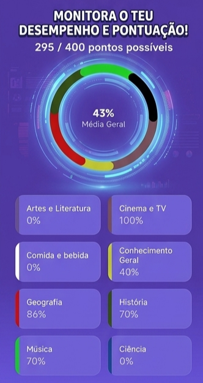

# Nuno Silva

Android Developer | Kotlin | Clean Architecture | Jetpack Compose

## 👨‍💻 About Me

Android Developer with 3+ years of professional experience building native Android applications using Kotlin and Jetpack Compose.

I have worked on production apps across different domains, including banking sector, where stability, quality and responsibility are critical.

I have a strong interest in software architecture, testing and delivery quality, applying principles such as Clean Architecture and MVVM in both professional and personal projects.

Part of my technical growth has come from hands-on personal projects, where I explored topics like modern UI with Compose, CI/CD pipelines, testing strategies and codebase modernization — experience that I actively apply in real production environments.

---

## 🛠 Tech Stack

---

## Quiz App

Multilingual quiz application built with:

- Kotlin
- Jetpack Compose
- Room
- Firebase Firestore
- Clean Architecture
- MVVM

## Features

- Multiple quiz categories
- Offline support with Room
- User progress tracking
- Statistics and results
- Multi-language support
  
## 📱 Screenshots

<table>
<tr>
<td align="center">
<b>Quiz</b> 

</td>
  
</tr> 
<td align="center">
<b>Categories</b> 

</td>

<td align="center">
<b>Results</b> 

</td>
</tr>
</table>

## 📫 Contact

- LinkedIn: https://www.linkedin.com/in/nuno-silva-b060851b3/
- Email: nunosilvaw33d@gmail.com
